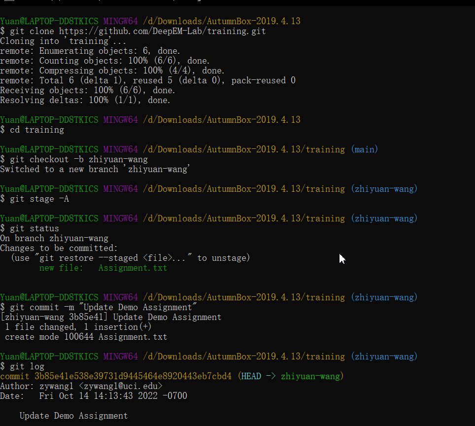
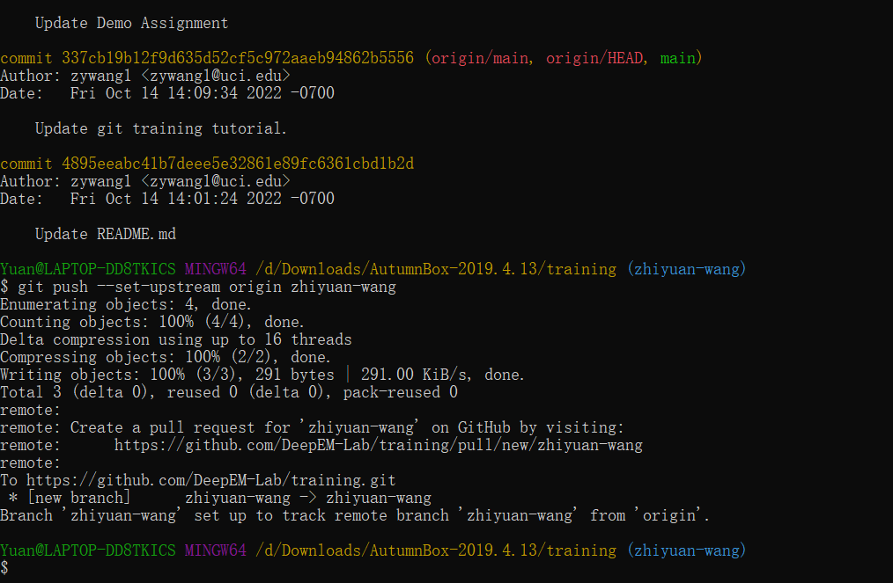

## Upload your assignments using git ##

#### 1. Clone this repository ####
> $ git clone https://github.com/DeepEM-Lab/training.git
* You should see a new folder is being downloaded.
> $ cd training
* Nevigate to the training folder.

#### 2. Create and checkout a new branch ####
> $ git checkout -b [breanch name]

#### 3. Move your assignments into the folder ####

#### 4. Stage all files in the folder to git ####
> $ git stage -A
* Make sure it's uppercase 'A'

#### 5. Check added files ####
> $ git status
* You should see a list of files are being added.

#### 6. Commit your changes ####
> $ git commit -m "[message]"

#### 7. Check previous commits ####
> $ git log
* You should see your most recent commit messages.

#### 8. Push your files to the origin/remote ####
> $ git push --set-upstream origin [branch name]

#### 9. Create a pull request on GitHub website ####
* Click "Pull Requests" on the GitHub website
* click "New Pull Request" on the top right
* Set the base branch to "main", set the compare branch to the branch you created.
* click "Create Pull Request" on the top right
* Fill in appropriate titles and messages.
* Create the pull request!

#### 10. Take a long break! everything is all set! ####

* Picture 1

* Picture 2
